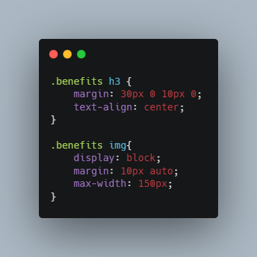

#  **HTML CSS Git Challenge: Code Refactor**

This is the completed first week challenge for the UPENN LPS Coding bootcamp.  The project required us to take an existing index.html file with a corresping style.css and to refactor the code in both files so that they follow best practices and meet accessibility standards.  

## **Link**

Here is a link to the [deployed application](https://gintstir.github.io/weekly-challenge-1/) 
For reference purposes, here is the screenshot provided in the challenge instructions.  The website above should \(at least 90 %\) resemble the included screenshot.
>

## **Motivation**

The motivation in completing this challenge was multifaceted, in using the "learning by doing" model of this program I was able to encounter new concepts, as well as explore, and expand my growing knowledge of html and css. This included but was not limited to:
- Learning about and become better acquainted with accessibility standards for things like screen readers.
    - using alt attributes for images.
- Impletmenting best practices in using semantic HTML element.
    - Making sure those elements follow a logical structure.
    - Making sure all links function properly.
- Using proper commentary for both HTML and css.
- Learning to fork, clone, pull, and push using the command line and [Github](http://github.com).
- Learning how to publish a finished project to a live URL using Github Pages.
- Learning the importance of README.md 
    - Successfully using markdown to present a clear and well formatted README.
  

## **Build Status**

For the pruposes of this weekly challenge this build should be considered complete barring any mistakes or omissions by me.  

## **Code Style**

This project used very basic HTML and CSS.  

## **Screenshots**  
This is a screen shot of the deployed website:
>

Here is a screenshot Here are some examples of my work I was able to accomplish in this project.

Here is an example of the original code which was missing semantic elements and commentary:
>

Here is the revised code:
>

Here is an example of the addition of an <alt> tag being implemeted in the refactored code where before there was none:
>

Finally, an example showing redudant or repetive styles being used in the original application:
> 

 Versus the new more concise and consolidated css:
> 

## **Tech Used**

- Built With
    - [VS Code](https://code.visualstudio.com/)
    - [Lighthouse](https://developers.google.com/web/tools/lighthouse/)
    - [Wave](https://wave.webaim.org/)
    - [Carbon](https://carbon.now.sh/)

## **Credits**

Thanks to UPennLPS Coding Bootcamp.  Thanks to the original creator of the [repository](https://github.com/coding-boot-camp/urban-octo-telegram)  used in this assignment: [Xandromus](https://github.com/Xandromus).  Thank you to the bootcamp instructors and TA's for all their help along the way ❤.  
